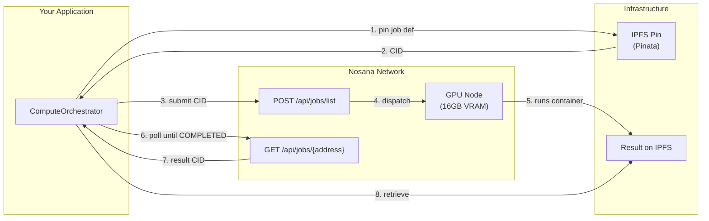

# Nosana Decentralised Compute — Integration Reference

> **This repository is a focused, technical reference for the Nosana
> decentralised GPU compute integration extracted from the Run-Fi
> reconciliation platform. It is not the Run-Fi product itself.**
> The Run-Fi platform — including its matching engine, adapters, data schema,
> API surface, and commercial strategy — remains proprietary and is not
> included here.

This repo demonstrates a production-grade integration with the **Nosana
decentralised GPU network** for ML inference workloads. It covers job dispatch,
IPFS pinning, polling, result retrieval, automatic fallback, and a deployable
inference container — all the infrastructure plumbing needed to run embedding
and LLM inference on Nosana GPU nodes.

## Compute architecture



Two compute backends are supported behind the `ComputeBackend` interface:

| Backend | Auth | Payment | Status |
|---|---|---|---|
| **REST (credits)** | API key (`nos_xxx`) | Dashboard credits | Live (`src/compute/nosana_client.py`) |
| **On-chain (NOS tokens)** | Solana wallet | NOS tokens | Stubbed, deferred (`src/compute/nosana_onchain.py`) |

## Repository structure

```
src/compute/
  base.py              # ComputeBackend interface, JobState, JobSpec, poller
  nosana_client.py     # Nosana REST API client (credits, API-key auth)
  nosana_onchain.py    # Nosana on-chain client (NOS tokens, stubbed)
  orchestrator.py      # Backend selector with fallback logic
inference/
  Dockerfile           # GPU container for Nosana nodes
  server.py            # FastAPI server (POST /embed, POST /resolve)
  entrypoint.sh        # Container entrypoint
  requirements.txt     # Inference dependencies
  docker-compose.yml   # Run the inference container locally
nosana/
  job.json             # Nosana deployment job template
example/
  run_embedding.py     # End-to-end: submit + poll + retrieve
  similarity_demo.py   # Embedding similarity via Nosana compute
  cost_benchmark.py    # Measure real credit cost per embedding
  credits_monitor.py   # Check remaining dashboard credits
docs/
  nosana-integration.md # Full technical reference
```

## Quick start

### 1. Prerequisites

- Python 3.11+
- A [Nosana dashboard](https://deploy.nosana.com) account with API key
- A [Pinata](https://pinata.cloud) account with JWT for IPFS pinning
- Docker (to build and test the inference container locally)

### 2. Install client dependencies

```bash
pip install -r requirements.txt
```

### 3. Test the inference container locally

```bash
cd inference
docker compose up
curl -X POST http://localhost:8000/embed \
  -H "Content-Type: application/json" \
  -d '{"texts": ["Sample transaction"]}'
```

### 4. Build and push for Nosana

```bash
docker build -t your-registry/inference:0.1.0 ./inference
docker push your-registry/inference:0.1.0
```

### 5. Run the end-to-end example

```bash
export NOSANA_API_KEY="nos_..."
export PINATA_JWT="..."
export NOSANA_MARKET_ADDRESS="..."  # optional
export WORKER_IMAGE="your-registry/inference:0.1.0"

python example/run_embedding.py
```

## Examples

| Script | What it does |
|---|---|
| `example/run_embedding.py` | Full end-to-end: pin job def, submit to Nosana, poll, retrieve result |
| `example/similarity_demo.py` | Generate embeddings for two texts, compute cosine similarity |
| `example/cost_benchmark.py` | Submit N embedding jobs, aggregate credit cost per embedding |
| `example/credits_monitor.py` | Check remaining Nosana dashboard credits |

## Key design decisions

- **Polling over webhooks** — Nosana's REST API does not offer webhooks; the
  client polls `GET /api/jobs/{address}` every 2s until terminal (verified
  against `@nosana/api@2.6.1` source).
- **IPFS via Pinata** — Job definitions are pinned to IPFS before posting.
  This is a Nosana requirement, not a dashboard route.
- **API schema over docs** — docs.nosana.io diverges from the actual API in
  several places (see `docs/nosana-integration.md`). The client follows the
  published `@nosana/api@2.6.1` OpenAPI schema.
- **Dual compute model** — The `ComputeBackend` interface supports both the
  REST/credits path and the on-chain NOS token path, selectable per config.
- **Idempotency** — Batch operations use the `Idempotency-Key` header so
  retries do not produce duplicate jobs.

## Verified API routes

All routes verified against `@nosana/api@2.6.1` source:

| Operation | Method | Path |
|---|---|---|
| Post job | POST | `/api/jobs/list` |
| Get job | GET | `/api/jobs/{address}` |
| Extend job | POST | `/api/jobs/{address}/extend` |
| Stop job | POST | `/api/jobs/{address}/stop` |
| Batch post | POST | `/api/jobs/list/batch` |
| Credits balance | GET | `/api/credits/balance` |
| List markets | GET | `/api/markets/` |

## Licence

Apache 2.0 — see [LICENSE](LICENSE).
